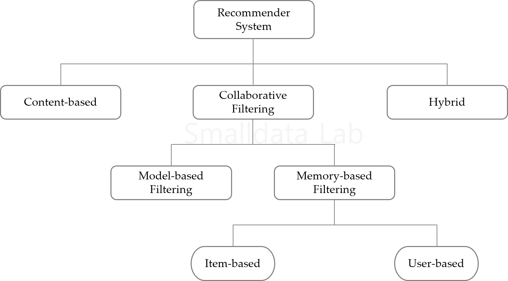

## **추천 시스템 개요**

- 정보기술의 발달과 모바일 기기의 대중화로 전자상거래 시장규모가 급속하게 커지고 있음.
- 이로 인해 수많은 신제품이 출시되지만 고객들은 오히려 제품을 선택하는데 많은 시간이 걸리고 어려움에 직면하고 있음. 
- 이에 따라 추천 시스템의 중요성이 대두되고 있으며, 세계적인 기업들은 오래전부터 추천 시스템을 활용하여 다양한 서비스를 제공하고 있음.

## **추천 시스템 종류**
  - 추천 시스템은 사용자가 선호할 만한 아이템을 추측함으로써 여러 가지 항목 중 사용자에게 적합한 특정 항목을 선택(information filtering)하여 제공하는 기법임.
  - 아래 그림은 일반적으로 사용되고 있는 다양한 추천 시스템의 종류를 보여주고 있음.

### 
###  
  
  

### 
###   
- 본 글에서는 추천 시스템에서 일반적으로 많이 사용되고 있는 콘텐츠 기반 추천 시스템과 협업 필터링 기반 추천 시스템에 대하여 살펴보고 각각의 장단점을 알아봄.
- 또한, 이들의 단점을 보완하기 위해 많이 사용되고 있는 하이브리드 추천 시스템도 살펴봄.

## **3. 콘텐츠 기반 추천 시스템**

### 3.1 **개요**

- **콘텐츠 기반 추천 시스템은 아이템을 분석한 프로파일(item profile)과 사용자의 선호도를 추출한 프로파일(user)을 추출하여 이의 유사성을 분석하여 이를 토대로 사용자에게 아이템을 추천해주는 방식임.**
  - 예를 들어, 유명한 음악 사이트인 판도라(Pandora)의 경우, 신곡이 출시되면 음악을 분석하여 장르, 비트, 음색 등 약 400여 항목의 특성을 추출함.
  - 그리고 사용자로부터는 ‘like’를 받은 음악의 특색을 바탕으로 해당 사용자의 프로파일을 준비함.
  - 이러한 음악의 특성과 사용자 프로파일을 비교함으로써 사용자가 선호할 만한 음악을 제공하게 됨.
  

### **3.2 특징**

- 장점
  - 추천하고자 하는 고객의 독립적인 정보만을 필요로 하므로, 다른 사용자의 정보가 부족할 경우에도 유용하고 사용할 수 있는 추천 기법임.
  - 아이템에 대한 평점이 존재하지 않더라도 사용자가 선호하는 아이템을 추천하기 때문에 First rater 문제가 발생하지 않음.

- 단점
  - 추천 대상이 되는 사용자의 과거 구매 이력을 바탕으로 유사한 제품을 찾아주기 때문에 다른 사용자들의 취향이나 선호도를 반영하지 못함.
  - 사용자 선호도를 파악할 때 구매 이력과 프로파일 정보가 부족하면 시스템 구현이 불가능함. 

### 3.3 **분석 알고리즘**
- 이 기법은 콘텐츠의 내용을 분석해야 하므로 아이템 분석 알고리즘이 핵심적이며, 이를 위 해 군집분석(Clustering analysis), 인공신경망(Artificial neural network), tf-idf(term frequencyinverse document frequency) 등의 기술이 사용됨(추가 예정).
  

